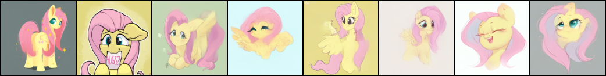

# Denoising-Diffusion-Probabilistic-Model
An implementation of denoising diffusion probabilistic models using PyTorch

# Dependencies
- pytorch
- tqdm
- matplotlib
- einops
- accelerate

# Command to run the model
```bash
accelerate launch main.py
```
or
```bash
python main.py
```

# Results


 


